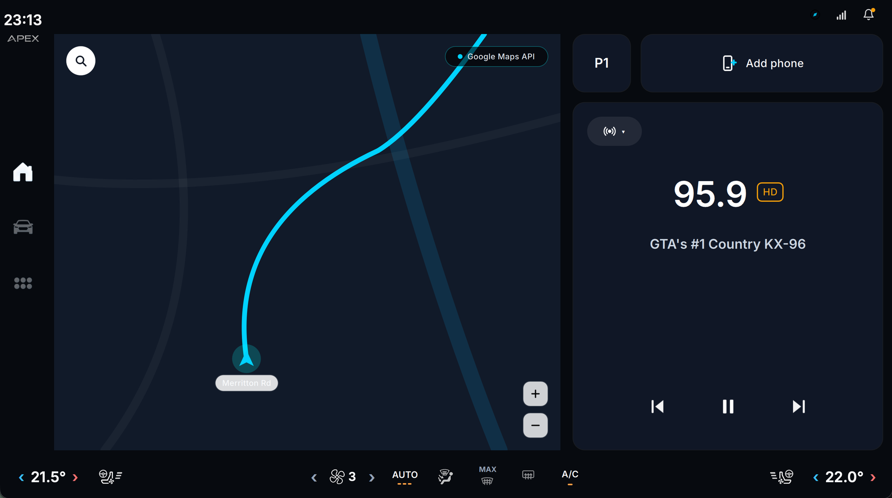
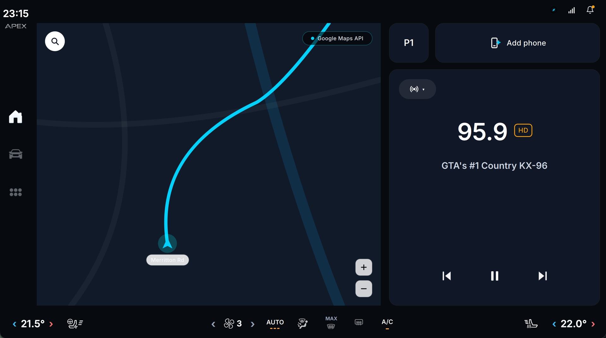

# Apex VISION IVI - Automotive In-Vehicle Infotainment System

<div align="center">


### Production-Grade Automotive Human-Machine Interface (HMI) and Digital Cockpit Head Unit

[](https://www.qt.io/)
[](https://isocpp.org/)
[](CMakeLists.txt)
[](.github/workflows/build-macos.yml)
[](.github/workflows/build.yml)
[](.github/workflows/build-windows.yml)
[](https://github.com/skrehanahamed/Apex_Vision_IVI/releases)
[](https://github.com/skrehanahamed)
[](LICENSE)

<br/>

<sub>Made by <b>Sk Rehan Ahamed</b> with the help of <b>Antigravity</b></sub>

</div>

---

## Executive Overview

Apex VISION IVI is a production-grade automotive In-Vehicle Infotainment (IVI) system and digital cockpit head unit engineered with Qt 6 (QML / Qt Quick), WebEngine WebGL 3D acceleration, and modern C++20. Modeled on modern connected electric vehicle (EV) widescreen cockpit architectures, the system features a hardware-accelerated dual-viewport dashboard, live 3D perspective cockpit navigation with 3D buildings and real-time reverse geocoding, full HVAC and seat comfort management with interactive flyouts, synchronized vehicle telemetry simulation, and media streaming controls.

The architecture decouples the QML presentation layer from deterministic C++ backend controllers, establishing an automotive-compliant state machine that manages live navigation telemetry, reverse geocode lookups, thermal comfort states, and audio/media arbitration.

---

## Visual Showcase and Subsystem Tour

<div align="center">

### 1. Dual-Card Cockpit Home and Status Chrome

*Widescreen digital cockpit head unit featuring live 3D perspective navigation card, media player with waveform visualizer, persistent top status bar, and automotive dock controls.*

<br/>

### 2. Multi-Zone Climate and Seat Thermal Comfort

*Interactive thermal comfort control featuring independent dual-zone temperature regulation, 3-level seat ventilation and heating flyout, steering wheel heating, and airflow distribution.*

</div>

---

## Subsystem Specifications

### 1. 3D Cockpit Navigation and Geospatial Engine
- Rendering Pipeline: Hardware-accelerated WebGL 3D engine powered by MapLibre GL and QtWebEngineQuick.
- 3D Perspective: 56-degree forward-looking driving pitch with vector extruded 3D buildings (OpenFreeMap planet vector tiles).
- Base Cartography: High-resolution OpenStreetMap raster tiles capped at zoom level 18.0 to prevent void zoom states.
- Live GPS Coordinate Acquisition: Asynchronous startup resolution via network IP geolocation (`https://ipwho.is/` with fallback to `https://ipapi.co/json/`) for immediate, card-free global location positioning.
- Reverse Geocoding: Automated OpenStreetMap Nominatim query engine resolving live coordinates to street-level metadata (e.g. road, pedestrian way, suburb).
- Rate-Limited Geocoding Cache: Distance-delta thresholding preventing redundant Nominatim network calls during cruising.
- Navigation Reference Marker: 3D elliptical ground disc with directional blue chevron rotating 0 to 360 degrees and dynamic street name badge.
- Open-Source Map Attribution: Official OpenStreetMap branding badge with logo and company name displayed in the viewport corner.

### 2. HVAC, Climate and Thermal Comfort Suite
- Dual-Zone Temperature Control: Independent driver and passenger thermal regulation ranging from 16.0 C to 28.0 C with fine-grained 0.5 C stepping.
- 3-Level Seat Ventilation: Independent driver and passenger seat cooling with active blue level indicators and contextual flyout dialogs.
- 3-Level Seat Heating: High-efficiency PTC heating control with 3-stage visual state feedback.
- Steering Wheel Heating: Integrated driver thermal control with dedicated toggle status.
- Airflow Distribution: Configurable multi-zone vent routing (Windshield Defrost, Face Vents, Footwell Vents).
- Defrost Modes: Dedicated MAX Front Windshield Defrost and Rear Heated Glass controls.

### 3. Vehicle Telemetry and CAN Bus Simulator
- Dynamic Cruising Loop: Periodic 500 ms simulation timer modeling realistic highway driving conditions.
- Powertrain Metrics: Real-time calculation of vehicle cruising speed (64 to 72 km/h) and correlated engine/motor RPM (1900 to 2200 RPM).
- Energy Storage: Battery State of Charge (SoC) monitoring with level reporting.
- Transmission State: PRND electronic shift selector telemetry.
- Environmental Sensors: Outside ambient temperature sensing (21.5 C nominal).

### 4. Media Player and Audio Architecture
- Playback Telemetry: Track title, artist, album, elapsed track time, total track duration, and album artwork.
- Interactive Timeline: Dynamic progress bar with scrubbing and 500 ms position tracking.
- Audio Controls: Previous track, play/pause toggle, next track, and audio source selection.
- Waveform Visualizer: Animated audio spectrum visualization reflecting active media streaming states.

### 5. Telephony and Connected Cockpit Suite
- Status Chrome: Persistent top status bar displaying vehicle speed indicator, connectivity status, cellular signal strength, GPS lock, current time, and ambient temperature.
- Application Navigation: Side navigation dock enabling rapid transitions between Home, Vehicle Controls, Phone, and System Settings.
- Responsive HMI: Optimized for 1024x600, 1280x720, and 1920x720 automotive touchscreen displays.

### 6. Design System and Automotive Ergonomics
- Typography: Inter typeface family (Regular, Medium, SemiBold, Bold) bundled in application resources for deterministic text rendering across all platforms.
- Contrast Compliance: Deep slate automotive dark palette (`#0E1522`, `#162032`, `#1E293B`) adhering to ISO 15008 visual presentation standards for automotive displays.
- Visual Hierarchy: Frosted glassmorphism overlays with backdrop blur filters, high-visibility blue navigation accents (`#2563EB`, `#00D2FF`), and clear driver state affordances.

---

## Directory Structure

```
Apex_Vision_IVI/
├── CMakeLists.txt                # CMake build configuration for Qt 6 and QtWebEngine
├── Makefile                      # Top-level make targets (build, run, clean)
├── README.md                     # System documentation and architecture guide
├── LICENSE                       # MIT License file
├── THIRD_PARTY_LICENSES.md       # Open-source license attributions
├── .gitignore                    # Git exclusions
├── .github/                      # GitHub configurations
│   └── workflows/                # Continuous integration workflows
│       ├── build.yml             # Ubuntu Linux Qt 6 CI
│       ├── build-macos.yml       # macOS Clang & Homebrew Qt CI
│       ├── build-windows.yml     # Windows MSVC 2022 CI
│       └── release.yml           # Automated release packager
├── docs/                         # System documentation and visual media
│   └── screenshots/              # Cockpit interface screenshots
│       ├── 01_cockpit_dashboard.png
│       └── 02_climate_seat_comfort.png
├── backend/                      # C++20 backend engines
│   ├── VehicleSimulator.h/.cpp   # Vehicle physics and telemetry simulator
│   ├── VehicleBackend.h/.cpp     # Vehicle status and lighting controller
│   ├── ClimateBackend.h/.cpp     # Dual-zone HVAC and seat comfort controller
│   ├── MediaBackend.h/.cpp       # Audio and media playback state machine
│   ├── NavigationBackend.h/.cpp  # Live GPS, reverse geocoding, and map bridge
│   ├── PhoneBackend.h/.cpp       # Telephony and call management
│   └── SystemBackend.h/.cpp      # System status and display controller
├── main.cpp                      # Application entry point and QML runtime init
├── qml/                          # Qt Quick presentation layer
│   ├── Main.qml                  # Root window and viewport coordinator
│   ├── Typography.qml            # Shared typographical design tokens
│   ├── assets/                   # Vector and raster UI iconography
│   │   ├── fonts/                # Bundled Inter typeface font files
│   │   └── icons/                # Cockpit controls, climate, and media icons
│   ├── components/               # Reusable automotive cockpit components
│   │   ├── ClimateBar.qml        # Bottom climate dock with seat flyouts
│   │   ├── NavigationPanel.qml   # 3D navigation card with WebEngine viewport
│   │   ├── MediaCard.qml         # Music player card with progress bar
│   │   ├── StatusBar.qml         # Persistent top status chrome
│   │   ├── SideNavigation.qml    # Primary app dock
│   │   ├── TemperatureControl.qml# Dual-zone rotary temperature picker
│   │   └── IconButton.qml        # Automotive touch button primitive
│   └── pages/                    # Cockpit application screens
│       ├── HomePage.qml          # Split-view dual card home screen
│       ├── VehiclePage.qml       # Vehicle settings and status display
│       ├── PhonePage.qml         # Telephony interface
│       ├── AppsPage.qml          # Application drawer
│       └── SettingsPage.qml      # System configuration page
└── web/                          # Embedded 3D navigation web assets
    ├── map.html                  # MapLibre GL 3D perspective navigation view
    ├── osm_logo.png              # OpenStreetMap attribution logo mark
    └── osm_logo_with_name.png    # OpenStreetMap attribution badge with name
```

---

## Build and Execution

### Prerequisites

- Compiler: C++20 compliant compiler (GCC 11+, Clang 13+, MSVC 2019+)
- Build System: CMake 3.20+ and Ninja or Make
- Framework: Qt 6.5+ with the following components:
  - `Qt6::Core`
  - `Qt6::Gui`
  - `Qt6::Quick`
  - `Qt6::Qml`
  - `Qt6::QuickControls2`
  - `Qt6::Svg`
  - `Qt6::Network`
  - `Qt6::WebEngineQuick`

### macOS (Apple Silicon / Intel)

```bash
# 1. Install Qt 6 and QtWebEngine via Homebrew
brew install qt qtwebengine ninja

# 2. Build the application using Makefile
make

# 3. Launch the application
make run
```

### Ubuntu Linux (22.04 LTS / 24.04 LTS)

```bash
# 1. Install system build dependencies
sudo apt-get update
sudo apt-get install -y \
  build-essential cmake ninja-build \
  libgl1-mesa-dev libxkbcommon-dev libxkbcommon-x11-dev \
  libfontconfig1-dev libfreetype6-dev libasound2-dev libpulse-dev

# 2. Configure with CMake (pointing to Qt 6 installation)
cmake -B build -G Ninja -DCMAKE_BUILD_TYPE=Release

# 3. Build and launch
cmake --build build -j$(nproc)
./build/apex_vision_ivi
```

### Windows (MSVC 2022)

```cmd
:: 1. Open Visual Studio x64 Native Tools Command Prompt
:: 2. Configure with CMake
cmake -B build -G Ninja -DCMAKE_BUILD_TYPE=Release -DCMAKE_PREFIX_PATH="C:\Qt\6.5.3\msvc2019_64"

:: 3. Build and launch
cmake --build build --config Release --parallel
build\apex_vision_ivi.exe
```

---

## GitHub Actions Continuous Integration

The repository includes continuous integration workflows in `.github/workflows/`:

- `build.yml`: Compiles and verifies the Linux Qt 6 application with CMake and Ninja on Ubuntu 22.04.
- `build-macos.yml`: Validates macOS build targets with Clang and native Homebrew Qt 6.
- `build-windows.yml`: Validates Windows build targets with MSVC 2022 and Qt 6.
- `release.yml`: Automated multi-platform release packager producing versioned binaries and distribution archives on tagged commits.

---

## Third-Party Credits and Acknowledgments

We gratefully acknowledge the following open-source projects, tools, and research:

- Qt Project: Cross-platform GUI and automotive application framework (Qt Quick, QML, QtWebEngine).
- MapLibre GL JS: High-performance open-source WebGL map rendering engine enabling hardware-accelerated 3D cockpit perspective.
- OpenStreetMap Contributors: Global open spatial database powering cartography and geospatial coordinates.
- OpenFreeMap: Community-driven 3D vector tile infrastructure providing vector building extrusions.
- Nominatim: OpenStreetMap search and reverse-geocoding engine for live automotive street resolution.
- Rasmus Andersson: Inter font family designed for computer screens and automotive digital displays.

---

## License

This project is licensed under the MIT License - see the [LICENSE](LICENSE) file for details.  
Third-party licenses and acknowledgments are documented in [THIRD_PARTY_LICENSES.md](THIRD_PARTY_LICENSES.md).
