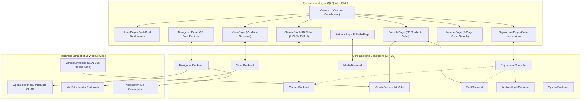
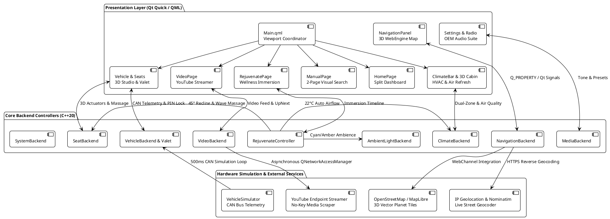
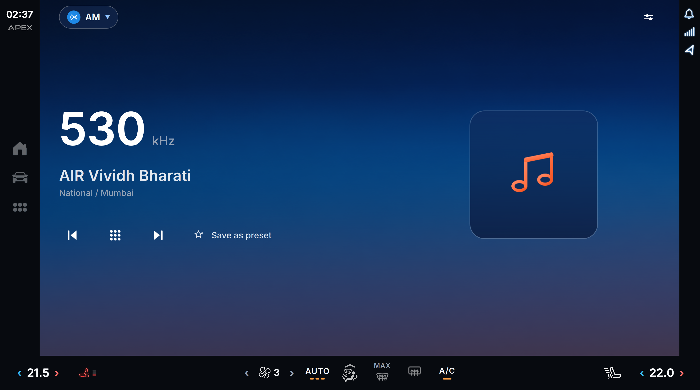

# Apex VISION IVI - Automotive In-Vehicle Infotainment System

<div align="center">


### Production-Grade Automotive Human-Machine Interface (HMI) and Digital Cockpit Head Unit

[](https://www.qt.io/)
[](https://isocpp.org/)
[](CMakeLists.txt)
[](.github/workflows/build-macos.yml)
[](.github/workflows/build.yml)
[](.github/workflows/build-windows.yml)
[](https://github.com/skrehanahamed/Apex_Vision_IVI/releases)
[](https://github.com/skrehanahamed)
[](LICENSE)

<br/>

<sub>Made by <b>Sk Rehan Ahamed</b> with the help of <b>Antigravity</b></sub>

</div>

---

## Executive Overview

Apex VISION IVI is a production-grade automotive In-Vehicle Infotainment (IVI) system and digital cockpit head unit engineered with Qt 6 (QML / Qt Quick), WebEngine WebGL 3D acceleration, and modern C++20. Modeled on modern connected electric vehicle (EV) widescreen cockpit architectures, the system features a hardware-accelerated dual-viewport dashboard, live 3D perspective cockpit navigation with vector 3D buildings, an integrated native **YouTube Video Streaming Suite** with infinite feed browsing and seamless Up Next recommendations, the **APEX Rejuvenate™ Stationary Wellness Immersion Suite** synchronized across vehicle climate, motorized seating, and ambient lighting, a **Digital Owner's Manual with 2-Page Visual Search and Hotspot Mapping**, full HVAC and seat comfort management, 3D interactive vehicle and cabin studios, multi-contour massage seat control, full-screen valet security locking, and a modern OEM cockpit settings suite.

The architecture strictly decouples the QML presentation layer from deterministic C++ backend controllers, establishing an automotive-compliant state machine that manages live telemetry, reverse geocode lookups, thermal comfort states, valet access arbitration, YouTube network extraction, multi-sensory wellness orchestration, and vehicle safety interlocks.

---

## System Architecture

The software architecture strictly adheres to automotive digital cockpit best practices, decoupling the declarative presentation layer from deterministic, thread-safe C++20 backend controllers:

<div align="center">


</div>

<details>
<summary><b>📊 Click to expand Interactive Mermaid Flowchart</b></summary>


```mermaid
graph TD
    subgraph QML["Presentation Layer (Qt Quick / QML)"]
        Main["Main.qml (Viewport Coordinator)"]
        Home["HomePage (Dual-Card Dashboard)"]
        NavView["NavigationPanel (3D WebEngine)"]
        ClimateView["ClimateBar & 3D Cabin (HVAC / PM2.5)"]
        VehicleView["VehiclePage (3D Studio & Valet)"]
        VideoView["VideoPage (YouTube Streamer)"]
        RejView["RejuvenatePage (Calm Immersion)"]
        ManualView["ManualPage (2-Page Visual Search)"]
        SettingsView["SettingsPage & RadioPage"]
    end

    subgraph Backend["Core Backend Controllers (C++20)"]
        NavB["NavigationBackend"]
        ClimB["ClimateBackend"]
        VehB["VehicleBackend & Valet"]
        SeatB["SeatBackend"]
        LightB["AmbientLightBackend"]
        VidB["VideoBackend"]
        RejC["RejuvenateController"]
        MedB["MediaBackend"]
        SysB["SystemBackend"]
    end

    subgraph External["Hardware Simulation & Web Services"]
        CAN["VehicleSimulator (CAN Bus 500ms Loop)"]
        OSM["OpenStreetMap / MapLibre GL 3D"]
        YT["YouTube Media Endpoints"]
        GEO["Nominatim & IP Geolocation"]
    end

    Main --> Home
    Main --> ClimateView
    Main --> VehicleView
    Main --> VideoView
    Main --> RejView
    Main --> ManualView

    NavView <--> NavB
    ClimateView <--> ClimB
    VehicleView <--> VehB
    VehicleView <--> SeatB
    RejView <--> RejC
    VideoView <--> VidB
    SettingsView <--> MedB

    RejC -.-> ClimB
    RejC -.-> SeatB
    RejC -.-> LightB

    NavB --> OSM
    NavB --> GEO
    VidB --> YT
    CAN --> VehB
```

</details>

<details>
<summary><b>📄 Click to expand PlantUML Architecture Specification</b></summary>


```plantuml
@startuml Apex_Vision_Architecture
!theme plain
skinparam backgroundColor transparent
skinparam componentStyle uml2
skinparam roundCorner 10
skinparam defaultFontName "Inter, Helvetica, Arial, sans-serif"
skinparam defaultFontSize 12

package "Presentation Layer (Qt Quick / QML)" as QML {
  [Main.qml\nViewport Coordinator] as Main
  [HomePage\nSplit Dashboard] as Home
  [NavigationPanel\n3D WebEngine Map] as NavView
  [ClimateBar & 3D Cabin\nHVAC & Air Refresh] as ClimateView
  [Vehicle & Seats\n3D Studio & Valet] as VehicleView
  [VideoPage\nYouTube Streamer] as VideoView
  [RejuvenatePage\nWellness Immersion] as RejView
  [ManualPage\n2-Page Visual Search] as ManualView
  [Settings & Radio\nOEM Audio Suite] as SettingsView
}

package "Core Backend Controllers (C++20)" as Backend {
  [NavigationBackend] as NavB
  [ClimateBackend] as ClimB
  [VehicleBackend & Valet] as VehB
  [SeatBackend] as SeatB
  [AmbientLightBackend] as LightB
  [VideoBackend] as VidB
  [RejuvenateController] as RejC
  [MediaBackend] as MedB
  [SystemBackend] as SysB
}

package "Hardware Simulation & External Services" as External {
  [VehicleSimulator\nCAN Bus Telemetry] as CAN
  [OpenStreetMap / MapLibre\n3D Vector Planet Tiles] as OSM
  [YouTube Endpoint Streamer\nNo-Key Media Scraper] as YT
  [IP Geolocation & Nominatim\nLive Street Geocoder] as GEO
}

Main -down-> Home
Main -down-> ClimateView
Main -down-> VehicleView
Main -down-> VideoView
Main -down-> RejView
Main -down-> ManualView

NavView <--> NavB : Q_PROPERTY / Qt Signals
ClimateView <--> ClimB : Dual-Zone & Air Quality
VehicleView <--> VehB : CAN Telemetry & PIN Lock
VehicleView <--> SeatB : 3D Actuators & Massage
RejView <--> RejC : Immersion Timeline
VideoView <--> VidB : Video Feed & UpNext
SettingsView <--> MedB : Tone & Presets

RejC -right-> ClimB : 22°C Auto Airflow
RejC -right-> SeatB : 45° Recline & Wave Massage
RejC -right-> LightB : Cyan/Amber Ambience

NavB --> OSM : WebChannel Integration
NavB --> GEO : HTTPS Reverse Geocoding
VidB --> YT : Asynchronous QNetworkAccessManager
CAN --> VehB : 500ms CAN Simulation Loop

@enduml
```

</details>

---

## Visual Showcase and Subsystem Tour

<div align="center">

### 1. Dual-Card Cockpit Home and Status Chrome

*Widescreen digital cockpit head unit featuring live 3D perspective navigation card, media player with waveform visualizer, persistent top status bar, and automotive dock controls.*

<br/>

### 2. Multi-Zone Climate and Seat Thermal Comfort

*Interactive thermal comfort control featuring independent dual-zone temperature regulation, 3-level seat ventilation and heating flyouts, steering wheel heating, and multi-zone airflow distribution.*

<br/>

### 3. Interactive 3D Multi-Contour Massage Seats

*Full-featured 3D seat studio allowing passenger and 2nd row seat adjustment, pneumatic lumbar support, cushion extension, and 3-zone multi-intensity massage cycles.*

<br/>

### 4. Cabin Air Refresh and PM2.5 Air Quality Suite

*Live cabin air purification monitor featuring real-time PM2.5 air quality gauge, multi-stage filtration indicators, and one-touch high-velocity cabin air refresh.*

<br/>

### 5. Full-Screen Valet Mode Security Lockout

*Automotive security overlay with 4-digit PIN authentication, interactive masked keypad, trunk/glove box lockout, and tamper-resistant unlock flows.*

<br/>

### 6. Acoustic Soundstage with Radiating Wave Ripples & Cabin Dissolve

*Acoustic balance and fader soundstage featuring zoomed-in cabin geometry seamlessly faded into ambient wallpaper gradients, real-time radiating sound wave ripples from the draggable reticle, and one-touch center reset.*

<br/>

### 7. Automotive Connectivity and Network Management

*Comprehensive connectivity control center managing Wi-Fi network scanning and associations, personal mobile hotspot sharing, cellular 5G data telemetry, and roaming toggles.*

<br/>

### 8. Voice Assistant and Speech Feedback Settings

*Integrated voice and assistant controls offering Google Assistant wake phrase detection ("Hey Google"), screen context analysis, offline speech processing, and language selection.*

<br/>

### 9. Native YouTube Video Feed & Categorical Browser

*Native YouTube video browsing with integrated search, touch keyboard, 7 category tabs (All, Trending, Music, Gaming, Movies, Podcasts, Live), infinite scroll, channel badges, view counts, and duration badges.*

<br/>

### 10. Cinematic Embedded YouTube Player with Instant Up Next Queue

*16:9 embedded player with full automotive controls, fullscreen expand within cockpit frame, and seamless instant-switching Up Next recommendations queue.*

<br/>

### 11. High-Precision OpenStreetMap Navigation Cartography

*Modern OpenStreetMap navigation integration running on official tile infrastructure without watermarks, API keys, or rate limits.*

<br/>

### 12. Digital Radio Tuner, Keypad & Presets

*Multi-band AM/FM/SiriusXM digital tuner with frequency keypad, preset star favorites, and live waveform visualization.*

<br/>

### 13. APEX Rejuvenate™ Multi-Sensory Wellness Suite

*Stationary in-cabin mindfulness experience in partnership with Calm, featuring theme cards (Waterfall, Ocean, Aurora), synchronized seat posture, micro-climate airflow, and ambient lighting.*

<br/>

### 14. Active Rejuvenation Immersion & Vehicle Actuator Synchronization

*Active wellness immersion displaying looping 4K nature video backdrops, spatial acoustics, interactive timeline milestones, countdown timer, and automatic vehicle safety park interlocks.*

<br/>

### 15. Digital Owner's Manual & Categorical Guide

*Full-featured digital handbook featuring interactive left draggable track thumb, categorized system guides, instant search, and sliding navigation stack animations.*

<br/>

### 16. Dual-View Visual Search with Cockpit & Exterior SUV Hotspot Pins

*Interactive visual exploration interface featuring high-resolution luxury cockpit and exterior SUV technical illustrations with touch beacon pins, hover callouts, and page navigation.*

<br/>

### 17. Deep-Dive Topics Reader & Emergency Safety Guides

*Drill-down topic reader with fluid horizontal sliding transitions, contextual safety warning banners, read-time badges, and direct breadcrumb navigation.*

</div>

---

## Subsystem Specifications

### 1. APEX Rejuvenate™ Multi-Sensory Wellness Suite (Stationary Immersion)
- **Multi-Sensory Orchestration Controller (`RejuvenateController`)**: State machine orchestrating synchronous transitions across vehicle subsystems during stationary parking:
  - **Motorized Seating (`SeatBackend`)**: Automatic seat transition from driving posture to **Relax Mode** (45° ergonomic recline) upon start, activating continuous pneumatic wave massage at Level 2, and automatic restoration to standard upright position upon completion.
  - **Micro-Climate Control (`ClimateBackend`)**: Temperature regulation to 22.0°C with automated gentle ambient cabin airflow (`AUTO` mode, A/C engaged).
  - **Spatial Ambient Lighting (`AmbientLightBackend`)**: Dynamic color transitions matching themes (e.g. Cyan Blue `#24D9FF` for Aurora, Deep Aqua for Ocean) with breathing brightness modulation.
- **Calm Audio/Visual Integration**: Integrated high-definition looping nature videos, soothing binaural audio streams, and synchronized timeline milestones (Preparing, In Progress, Concluding).
- **Automotive Safety Park Interlock**: Mandatory transmission Park (`P`) monitor. Shifting gears into Drive (`D`) or Reverse (`R`) immediately pauses the immersion, triggers an elevated safety modal, and safely halts motorized actuators.

### 2. Digital Owner's Manual & Visual Hotspot Navigation
- **3-Mode Tabbed Navigation**: Seamless switching between **Categories**, **Visual search**, and **Bookmarks** with sliding amber indicator underline.
- **2-Page Visual Search (Cockpit & Exterior SUV)**:
  - **Page 1 (Luxury Cockpit Interior)**: Interactive touch pins for Steering Controls, Digital Cockpit Cluster, 15.6" Infotainment Display, Center Console, Ambient Air Vents, and Seat Memory.
  - **Page 2 (Exterior SUV Perspective)**: Touch pins for Matrix LED Headlights, Front Radar & LiDAR sensors, Smart Keyless Mirrors, Power Charge Port, and Hands-Free Power Liftgate.
  - **Adaptive Hover Tooltips**: Responsive tooltips that automatically detect viewport boundaries to prevent edge clipping.
- **Fluid Horizontal Navigation Stack**:
  - Decoupled header layout with bidirectional horizontal slide animations for category breadcrumb titles (`0 → -60px` / `60px → 0`).
  - True off-screen content transitions (`100% viewport width → 0`) eliminating view overlap during drill-down into topics and articles.
- **Real-Time Touch Keyboard Search**:
  - Live query filtering across all manual chapters and subtopics.
  - Built-in automotive on-screen touch keyboard with Shift, Space, and Backspace.
- **Interactive Capsule Dragger**: Custom touch-target draggable capsule thumb synchronized bidirectionally with `Flickable.contentY`.

### 3. Native YouTube Video Hub & Embedded Streaming Engine
- **Asynchronous Scraping Engine (`VideoBackend`)**: Native C++ network client interacting directly with YouTube endpoints via `QNetworkAccessManager`, parsing initial data payloads and search streams without third-party API keys or quota limits.
- **7 Automotive Categorical Feeds**: One-touch category filtering for `All`, `Trending`, `Music`, `Gaming`, `Movies`, `Podcasts`, and `Live`.
- **Infinite Drag-Scroll Pagination**: Dynamic scroll-depth monitoring triggering automatic pre-fetching and append operations for seamless browsing.
- **Embedded Sandbox Player**: Hardware-accelerated QtWebEngineView loading sandbox embeds with Chromium flag `--autoplay-policy=no-user-gesture-required`.
- **Seamless Up Next Queue**: Tap-to-play related videos leveraging the YouTube iframe API (`loadVideoById`) for immediate in-place transitions without reload latency.
- **Cockpit-Preserving Fullscreen**: Full-bleed workspace expansion with permanent visibility of the left navigation rail, right status/slider bar, and bottom climate control dock.

### 4. 3D Cockpit Navigation and Geospatial Engine
- **Rendering Pipeline**: Hardware-accelerated WebGL 3D engine powered by MapLibre GL and QtWebEngineQuick.
- **3D Perspective**: 56-degree forward-looking driving pitch with vector extruded 3D buildings (OpenFreeMap planet vector tiles).
- **Base Cartography**: Official OpenStreetMap raster tile infrastructure (`tile.openstreetmap.de` & `tile.openstreetmap.fr`) completely free from watermarks or API key restrictions.
- **Live GPS Coordinate Acquisition**: Asynchronous startup resolution via network IP geolocation (`https://ipwho.is/` with fallback to `https://ipapi.co/json/`) for immediate global location positioning.
- **Reverse Geocoding**: Automated OpenStreetMap Nominatim query engine resolving live coordinates to street-level metadata.
- **Rate-Limited Geocoding Cache**: Distance-delta thresholding preventing redundant Nominatim network calls during cruising.
- **Navigation Reference Marker**: 3D elliptical ground disc with directional blue chevron rotating 0 to 360 degrees and dynamic street name badge.

### 5. HVAC, Climate, and Cabin Air Purification
- **Dual-Zone Temperature Control**: Independent driver and passenger thermal regulation ranging from 16.0°C to 28.0°C with fine-grained 0.5°C stepping.
- **3D Interactive Cabin Studio**: Real-time 3D rendered cabin view with interactive directional airflow vents.
- **Cabin Air Refresh Overlay**: Real-time cabin air purification loop with animated air particle streams and live PM2.5 index gauges.
- **3-Level Seat Ventilation & Heating**: Independent seat cooling and PTC heating control with 3-stage visual state feedback.
- **Defrost Modes**: Dedicated MAX Front Windshield Defrost and Rear Heated Glass controls.

### 6. Multi-Contour Massage and Seat Studio
- **Multi-Zone Pneumatic Massage**: Upper Back, Lower Back, and Cushion massage zones with independent intensity control (Off, Low, Medium, High).
- **Front Passenger & 2nd Row Controls**: Multi-seat selection menu with amber indicator underline and status telemetry.
- **Electric Actuator Adjustments**: Cushion height/tilt, seat track forward/backward sliding, and backrest recline controls.

### 7. Valet Mode Security Lockout System
- **PIN-Protected Security**: Full-screen modal overlay preventing unauthorized access to vehicle settings, personal data, and storage compartments.
- **Secure Keypad HMI**: Automotive touch keypad with PIN confirmation, auto-clearing masked digits, and tactile click feedback.
- **System Lockout State**: Dynamic status broadcasting to all IVI pages and lock confirmation indicators.

### 8. Automotive OEM Settings Architecture & Multi-Category Navigation
- **Top Header Bar**: Dual-column header featuring standalone circular sliders logo, bold "Settings" title, standard `←` return navigation, and dynamic section titles.
- **7-Category Navigation Rail**: Full automotive OEM settings hierarchy:
  - **Connectivity**: Wi-Fi network scanning, connection status, Bluetooth device pairing, and Mobile Hotspot management.
  - **Voice & Assistant**: Google Assistant voice feedback options, sensitivity calibration, and customizable wake phrases.
  - **Location**: System GPS toggle, recent location requests, and granular application location permissions.
  - **Notifications**: In-cluster urgent safety warnings, drive summaries, and scheduled quiet hours.
  - **Privacy**: Vehicle telemetry and data sharing controls, microphone privacy indicators, and valet lock mode.
  - **System**: Multi-language localization, 12h/24h clock toggle, Imperial/Metric unit selection, OTA software updates, and visual storage allocation graphs.
  - **Accessibility**: High-contrast display mode, closed captioning styling, and interactive screen magnification.
- **Dynamic Visual State Lighting**: Selected category icon illuminates in vibrant OEM **yellow** (`#FBBF24`), while unselected icons remain crisp pure **white** (`#FFFFFF`).
- **Fluid Horizontal Slide Transitions**: Smooth directional sliding animations between the primary categories and nested sub-setting views.

### 9. Media Player, Audio, and Acoustic Soundstage Architecture
- **Acoustic Balance & Fade Soundstage**:
  - **Zoomed Cabin Geometry**: Focused interior cabin layout showcasing driver, passenger, and second-row seating with metallic roof contours.
  - **Theme-Blended Alpha Dissolve**: Vehicle top-view renders with a smooth cubic alpha gradient, blending effortlessly into active wallpapers (**Inspire**, **Constellation**, **Tranquil**, **Voyage**) without harsh bounding boxes.
  - **Radiating Acoustic Wave Ripples**: Animated concentric sound wave pulses continuously propagate outward in real-time from the draggable focal point.
  - **Interactive Reticle Thumb & Instant Reset**: Touch and drag positioning to adjust front/rear fade and left/right balance, with a one-touch "Reset" button restoring center equilibrium `(0, 0)`.
- **Dynamic Tone Controls**: 13-point discrete sliders (-6 to +6) for Bass, Midrange, and Treble with floating teardrop level tooltips.
- **Digital Radio Tuner & Frequency Keypad**: Multi-band AM, FM, and SiriusXM tuner with numeric frequency entry, preset bookmarking, and live waveform monitor.

---

## Directory Structure

```
Apex_Vision_IVI/
├── CMakeLists.txt                # CMake build configuration for Qt 6, QtWebEngine, and Multimedia
├── Makefile                      # Top-level make targets (build, run, clean)
├── README.md                     # System documentation and architecture guide
├── LICENSE                       # MIT License file
├── THIRD_PARTY_LICENSES.md       # Open-source license attributions
├── .gitignore                    # Git exclusions
├── .github/                      # GitHub configurations
│   └── workflows/                # Continuous integration workflows
│       ├── build.yml             # Ubuntu Linux Qt 6 CI
│       ├── build-macos.yml       # macOS Clang & Homebrew Qt CI
│       ├── build-windows.yml     # Windows MSVC 2022 CI
│       └── release.yml           # Automated release packager
├── assets/                       # Deployed external runtime assets
│   └── rejuvenate/               # High-definition audio, video, and theme configurations
│       ├── audio/                # Nature acoustic soundscapes (Waterfall, Ocean, Aurora)
│       ├── images/               # High-res preview cards and thumbnails
│       ├── themes/               # Theme JSON manifests with actuator sync parameters
│       └── video/                # Hardware-optimized looping nature MP4 backdrops
├── docs/                         # System documentation and visual media
│   └── screenshots/              # Cockpit interface screenshots (01 to 17)
│       ├── 01_cockpit_dashboard.png
│       ├── 02_climate_seat_comfort.png
│       ├── 03_seat_comfort_massage.png
│       ├── 04_cabin_air_refresh.png
│       ├── 05_valet_security_lock.png
│       ├── 06_acoustic_soundstage_balance_fade.png
│       ├── 07_connectivity_network_settings.png
│       ├── 08_voice_assistant_settings.png
│       ├── 09_youtube_video_feed.png
│       ├── 10_youtube_player_upnext.png
│       ├── 11_navigation_map.png
│       ├── 12_radio_media_center.png
│       ├── 13_rejuvenate_wellness_suite.png
│       ├── 14_rejuvenate_session_active.png
│       ├── 15_owners_manual_categories.png
│       ├── 16_owners_manual_visual_search.png
│       └── 17_owners_manual_topics_detail.png
├── backend/                      # C++20 backend engines
│   ├── VehicleSimulator.h/.cpp   # Vehicle physics and telemetry simulator
│   ├── VehicleBackend.h/.cpp     # Vehicle status and lighting controller
│   ├── ClimateBackend.h/.cpp     # Dual-zone HVAC and seat comfort controller
│   ├── MediaBackend.h/.cpp       # Audio and media playback state machine
│   ├── NavigationBackend.h/.cpp  # Live GPS, reverse geocoding, and map bridge
│   ├── PhoneBackend.h/.cpp       # Telephony and call management
│   ├── SystemBackend.h/.cpp      # System status and display controller
│   ├── VideoBackend.h/.cpp       # Native YouTube scraping and video player controller
│   ├── RejuvenateController.h/.cpp # Multi-sensory wellness orchestration controller
│   ├── RejuvenateTheme.h/.cpp    # Wellness theme and actuator manifest loader
│   ├── SeatBackend.h/.cpp        # Motorized seat posture and massage controller
│   └── AmbientLightBackend.h/.cpp# Dynamic RGB interior ambient light manager
├── main.cpp                      # Application entry point and QML runtime init
├── qml/                          # Qt Quick presentation layer
│   ├── Main.qml                  # Root window and viewport coordinator
│   ├── Typography.qml            # Shared typographical design tokens
│   ├── assets/                   # Vector and raster UI iconography
│   │   ├── fonts/                # Bundled Inter typeface font files
│   │   ├── icons/                # Cockpit controls, climate, settings, and media icons
│   │   └── avatars/              # OEM profile and identity avatars
│   ├── climate3d/                # 3D interactive studio views
│   │   ├── ClimateCabinView.qml  # 3D cabin airflow and thermal view
│   │   ├── SeatStudioView.qml    # 3D seat posture and massage view
│   │   ├── VehicleStudioView.qml # 3D vehicle exterior interactive studio
│   │   └── LaneKeepingCarView3D.qml # 3D lane-keeping assist chassis view
│   ├── components/               # Reusable automotive cockpit components
│   │   ├── ClimateBar.qml        # Bottom climate dock with seat flyouts
│   │   ├── Climate3DPanel.qml    # 3D climate overlay panel
│   │   ├── CabinAirRefreshOverlay.qml # PM2.5 air purification gauge overlay
│   │   ├── ValetLockOverlay.qml  # Full-screen PIN security lock overlay
│   │   ├── LaneKeepingVisualizer.qml # Interactive lane tracking & alert component
│   │   ├── NavigationPanel.qml   # 3D navigation card with WebEngine viewport
│   │   ├── MediaCard.qml         # Music player card with progress bar
│   │   ├── StatusBar.qml         # Persistent top status chrome
│   │   ├── SideNavigation.qml    # Primary app dock
│   │   ├── TemperatureControl.qml# Dual-zone rotary temperature picker
│   │   ├── IconButton.qml        # Automotive touch button primitive
│   │   ├── RejuvenateThemeCard.qml # Theme card with interactive preview
│   │   ├── RejuvenateStatusCard.qml# Actuator telemetry sync card
│   │   └── RejuvenateProgress.qml# Interactive session progress timeline
│   └── pages/                    # Cockpit application screens
│       ├── HomePage.qml          # Split-view dual card home screen
│       ├── VehiclePage.qml       # Vehicle settings and status display
│       ├── PhonePage.qml         # Telephony interface
│       ├── AppsPage.qml          # Application drawer
│       ├── SettingsPage.qml      # Automotive settings suite with 7-category slider navigation
│       ├── VideoPage.qml         # Native YouTube video streaming hub
│       ├── RadioPage.qml         # Multi-band digital radio tuner
│       ├── NewsPage.qml          # Live automotive news reader
│       ├── TowingPage.qml        # Towing & trailer management
│       ├── RejuvenatePage.qml    # APEX Rejuvenate™ stationary wellness portal
│       ├── RejuvenateSession.qml # Full-screen multi-sensory immersion session
│       └── ManualPage.qml        # Digital Owner's Manual with 2-page visual search
└── web/                          # Embedded 3D navigation web assets
    ├── map.html                  # MapLibre GL 3D perspective navigation view
    ├── osm_logo.png              # OpenStreetMap attribution logo mark
    └── osm_logo_with_name.png    # OpenStreetMap attribution badge with name
```

---

## Build and Execution

### Prerequisites

- **Compiler**: C++20 compliant compiler (GCC 11+, Clang 13+, MSVC 2019+)
- **Build System**: CMake 3.20+ and Ninja or Make
- **Framework**: Qt 6.5+ with the following components:
  - `Qt6::Core`
  - `Qt6::Gui`
  - `Qt6::Quick`
  - `Qt6::Qml`
  - `Qt6::QuickControls2`
  - `Qt6::Svg`
  - `Qt6::Network`
  - `Qt6::WebEngineQuick`
  - `Qt6::Multimedia`

### macOS (Apple Silicon / Intel)

```bash
# 1. Install Qt 6 and QtWebEngine via Homebrew
brew install qt qtwebengine ninja

# 2. Build the application using Makefile
make

# 3. Launch the application
make run
```

### Ubuntu Linux (22.04 LTS / 24.04 LTS)

```bash
# 1. Install system build dependencies
sudo apt-get update
sudo apt-get install -y \
  build-essential cmake ninja-build \
  libgl1-mesa-dev libxkbcommon-dev libxkbcommon-x11-dev \
  libfontconfig1-dev libfreetype6-dev libasound2-dev libpulse-dev

# 2. Configure with CMake (pointing to Qt 6 installation)
cmake -B build -G Ninja -DCMAKE_BUILD_TYPE=Release

# 3. Build and launch
cmake --build build -j$(nproc)
./build/apex_vision_ivi
```

### Windows (MSVC 2022)

```cmd
:: 1. Open Visual Studio x64 Native Tools Command Prompt
:: 2. Configure with CMake
cmake -B build -G Ninja -DCMAKE_BUILD_TYPE=Release -DCMAKE_PREFIX_PATH="C:\Qt\6.5.3\msvc2019_64"

:: 3. Build and launch
cmake --build build --config Release --parallel
build\apex_vision_ivi.exe
```

---

## GitHub Actions Continuous Integration

The repository includes automated CI workflows in `.github/workflows/`:

- `build.yml`: Compiles and verifies the Linux Qt 6 application with CMake and Ninja on Ubuntu 22.04.
- `build-macos.yml`: Validates macOS build targets with Clang and native Homebrew Qt 6.
- `build-windows.yml`: Validates Windows build targets with MSVC 2022 and Qt 6.
- `release.yml`: Automated multi-platform release packager producing versioned binaries and distribution archives on tagged commits.

---

## Third-Party Credits and Acknowledgments

We gratefully acknowledge the following open-source projects, tools, and research:

- **Qt Project**: Cross-platform GUI and automotive application framework (Qt Quick, QML, QtWebEngine, QtMultimedia).
- **MapLibre GL JS**: High-performance open-source WebGL map rendering engine enabling hardware-accelerated 3D cockpit perspective.
- **OpenStreetMap Contributors**: Global open spatial database powering cartography and geospatial coordinates.
- **OpenFreeMap**: Community-driven 3D vector tile infrastructure providing vector building extrusions.
- **Nominatim**: OpenStreetMap search and reverse-geocoding engine for live automotive street resolution.
- **Rasmus Andersson**: Inter font family designed for computer screens and automotive digital displays.

---

## Release History & Highlights

### [v2.3.0] - APEX Rejuvenate™ Multi-Sensory Wellness Suite, Digital Owner's Manual & Visual Search Navigation Stack
- **APEX Rejuvenate™ Stationary Wellness Immersion Suite**:
  - Integrated `RejuvenateController` state machine managing automated transitions across vehicle comfort subsystems.
  - Multi-actuator synchronization: Motorized relaxation recline (45°), wave pneumatic massage cycle, dual-zone micro-climate regulation, and cyan/amber ambient illumination.
  - High-definition nature video backdrops with looping video playback and spatial audio acoustic streams.
  - Safety Park Interlock & Drive Motion Monitor: Real-time Park (`P`) transmission lock validation, gear shifting detection, and safety alert modal with automatic session termination.
  - Interactive session timeline milestones: *Preparing*, *Active*, and *Concluding* with real-time countdown timer.
- **Digital Owner's Manual & Visual Hotspot Navigation**:
  - 3-Mode navigation: **Categories**, **Visual search**, and **Bookmarks** with sliding amber indicator underline.
  - 2-Page visual search (Cockpit Interior and Exterior SUV views) with interactive touch beacon pins, hover callouts, and direct topic linkage.
  - Fluid horizontal navigation stack with decoupled header breadcrumb transitions and true off-screen content transitions (`100% viewport width → 0`).
  - Real-time search engine with instant query filtering and embedded automotive touch keyboard.
  - Interactive left vertical draggable track thumb with generous touch target bounds.
- **Asset Optimization & Repository Hardening**:
  - Removed unwanted mock assets and compressed nature backdrops to fast-loading looping H.264 MP4s.
  - Updated architectural diagrams, directory trees, and complete 17-screenshot subsystem gallery.

### [v2.2.0] - Native YouTube Video Streaming Suite, Infinite Feed, Instant Up Next Queue & Enhanced OSM Navigation
- Native YouTube video hub with `VideoBackend` scraping, infinite drag-scroll, and category feeds.
- 16:9 embedded player with auto-hiding controls and zero-latency Up Next recommendations queue.
- Official OpenStreetMap raster tile infrastructure (`tile.openstreetmap.de` & `tile.openstreetmap.fr`).
- Multi-band digital radio tuner with frequency keypad and live waveform monitor.

### [v2.1.0] - Acoustic Soundstage Wave Ripples, Zoomed Cabin Fade, Tone Tooltips & 7-Category OEM Settings Suite
- Acoustic balance and fader soundstage with zoomed vehicle cabin and concentric sound wave pulse animation.
- Dynamic 13-point discrete tone sliders with floating teardrop level tooltips.
- 7-category OEM settings architecture with fluid horizontal slide animations.

### [v2.0.0] - 3D Cabin & Seat Studio, Valet Lock Mode, and OEM Settings Suite
- 3D interactive multi-contour massage seats and cabin airflow studio.
- Full-screen PIN security valet lock overlay with masked keypad.
- Real-time PM2.5 air quality gauge and high-velocity cabin air refresh cycle.

---

## License

This project is licensed under the MIT License - see the [LICENSE](LICENSE) file for details.  
Third-party licenses and acknowledgments are documented in [THIRD_PARTY_LICENSES.md](THIRD_PARTY_LICENSES.md).
